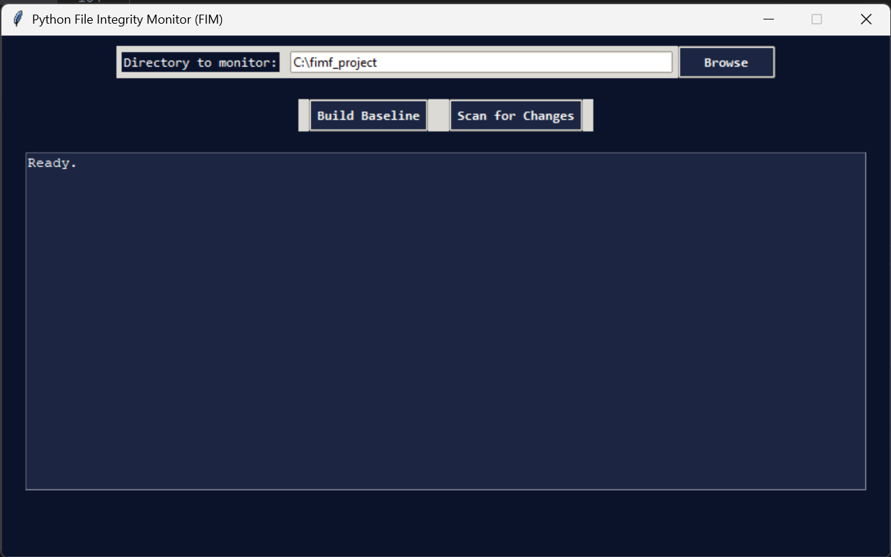

# 🛡️ File Integrity Monitoring GUI (Python)

A simple yet powerful **File Integrity Monitoring (FIM)** tool built in **Python** with a dark-themed **Tkinter GUI**.  
It detects unauthorized file changes — additions, deletions, and modifications — by hashing files and comparing them against a stored baseline.

---

## 🚀 Features
- 🧩 **Baseline Creation:** Generate secure SHA-256 hashes for all files in a selected folder.  
- 🔍 **Change Detection:** Identify files that have been added, removed, or modified.  
- 🖥️ **Dark Blue & Black GUI Theme:** Modern, clean interface for comfortable viewing.  
- 🧾 **Auto Logging:** Saves all results to `fim_log.txt`.  
- 💾 **Baseline Persistence:** Keeps file hash history in `baseline.json`.

---

## 🧠 How It Works
1. Select a folder to monitor.
2. Click **“Create Baseline”** → hashes are saved.
3. Click **“Scan Changes”** → compares new hashes to detect differences.
4. Any changes are displayed and logged automatically.

---

## 📁 Folder Structure
fimf_project/
│
├── fim_gui.py # Main GUI logic
├── README.md # Project documentation
├── .gitignore # Ignored files (log, baseline, cache)
├── fim_log.txt # Generated log (auto-created)
├── baseline.json # Hash storage (auto-created)
│
├── assets/ # (Optional) screenshots or icons
└── docs/ # (Optional) technical details

---

## 🧰 Technologies Used
- **Language:** Python 3  
- **Libraries:** `tkinter`, `os`, `hashlib`, `json`, `datetime`

---

## 🧩 Future Enhancements
- Real-time monitoring using background threads  
- Email alerts when files change  
- PDF or CSV report export  
- Cross-platform support (Windows, macOS, Linux)

---

## 🧑‍💻 Author
Devi Kiran 
B.Tech in Computer Science (Cybersecurity)  VIT Vellore
Built to explore the concepts of integrity verification and GUI-based Python tools.

---

## 🖼️ Screenshot

